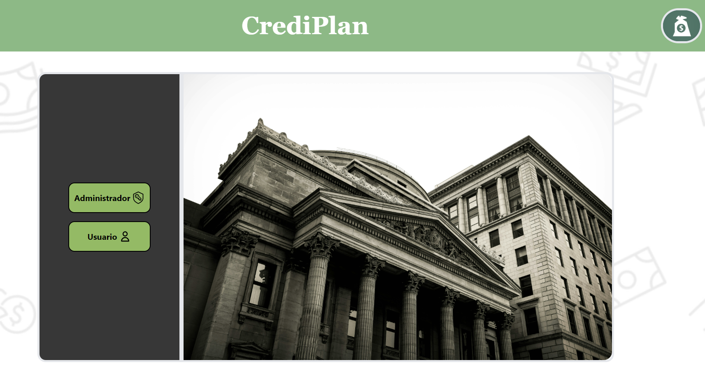
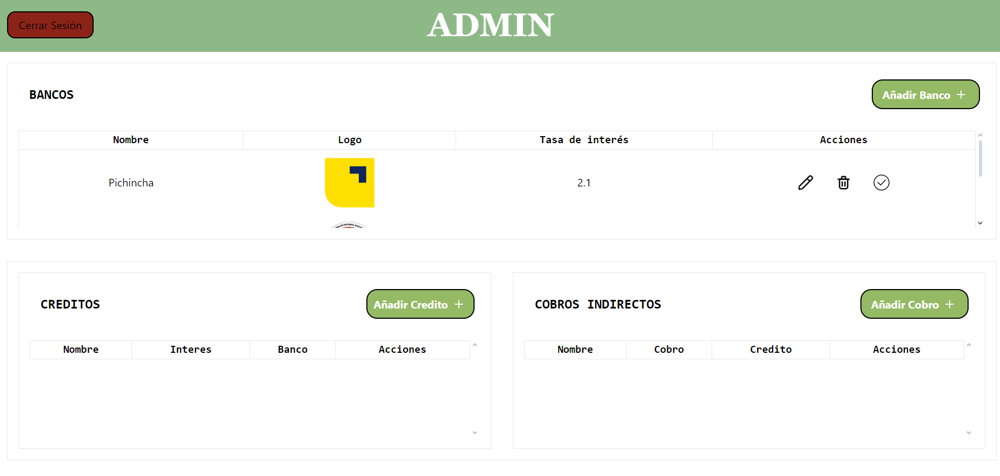
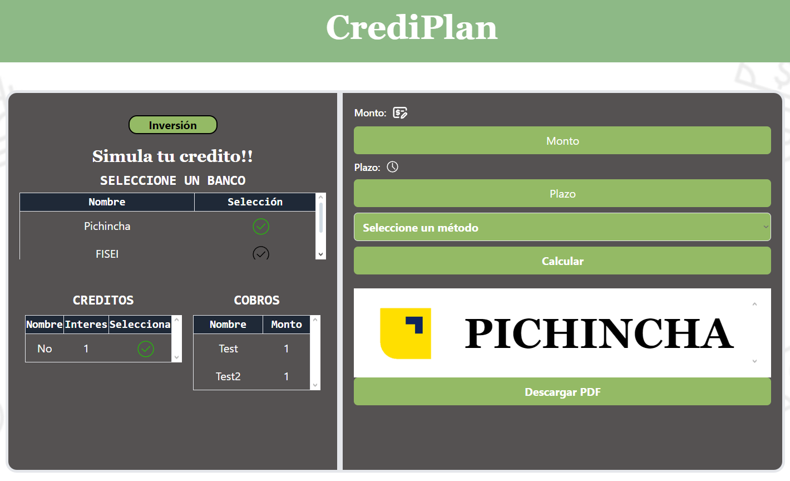
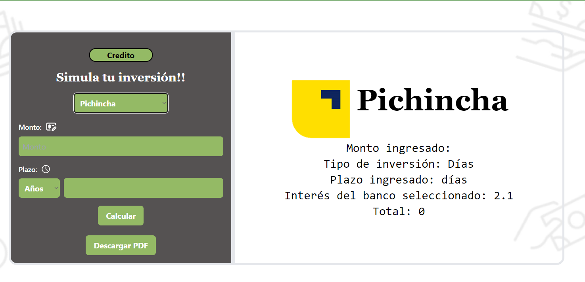

<p align="center">
  <a  target="blank"></a>
</p>

# CrediPlan 

A payment table simulator with two amortization systems: French and German
## Tech Stack

**Client:** Next.js, TailwindCSS, HTML

## Run Locally

Clone the project

```bash
  git clone https://github.com/ChristianCLop/frontend-simulador.git
```

Go to the project directory

```bash
  cd frontend-simulador
```

Install dependencies

```bash
  npm install
```

Start the server

```bash
  npm run dev
```

## Features

- Bank administration
- Credit Simulation
- Investment Simulation

## Screenshots
### Login


### Admin dashboard


### Credit Simulator


### Investment Simulator



## Authors

- [@Christian Chico](https://www.github.com/ChristianCLop)


## 🔗 Links
[](https://katherineoelsner.com/)

[](https://linkedin.com/in/christianchicolópez)

[](mailto:christian.chico@hotmail.com)

## Feedback

If you have any feedback, you can find me at my socials. 

